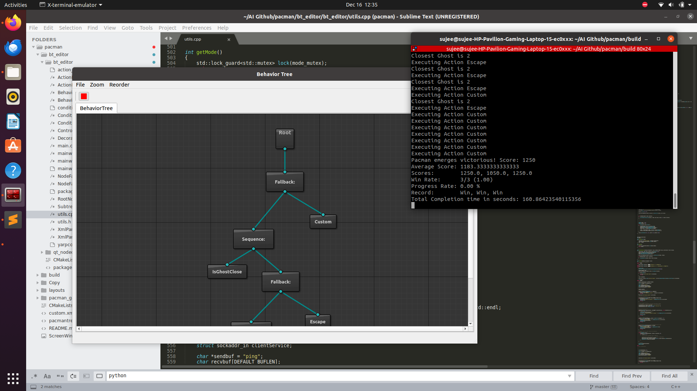
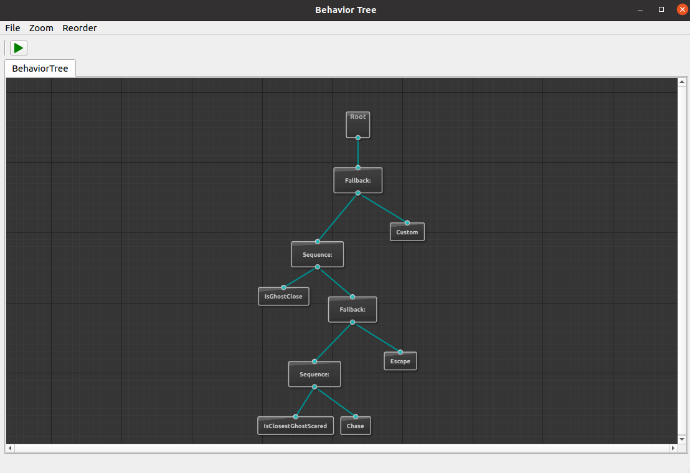

# Artificial Intelligence - 1  Course project (University of Minnesota, twin cities)

## Code changes compared to original code [Source](https://github.com/btirai/pacman)
[Compare Commit changes Link](https://github.com/Sujeendra/Behavioral-Tree-for-Pac-Man/compare/5dcf290..ac6a2c1)

##### Core files edited to implement custom action nodes and Deepsearch custom agents are as follows:

- ActionNodeModelPacman.hpp
- mainwindow.cpp
- utils.cpp
  
  Note* not within build folder
- pacman_game/bt/PacmanActionNodes.py 
- pacman_game/bt/PacmanAgents.py
- pacman_game/pacman.py
- pacman_game/util.py

## Result

[Link](https://drive.google.com/file/d/1PwWIkgVIvPc674TiXk426Nh8ELoFzt6h/view?usp=sharing)





## How to change the configuration?
```
Navigate to pacman/bt_editor/bt_editor/utils.cpp
edit runTree method and in UNIX section change the python3 pacman.py -n 3 -l trickyClassic -p BTAgent
for example trickyCLassic can be changed into smallClassic, mediumClassic etc
```


Installation in Unix
------------
1) Install Dependencies:

`sudo apt-get install build-essential libgl1-mesa-dev python3-tk qtdeclarative5-dev`

2) Download the repository:

`git clone https://github.com/Sujeendra/Behavioral-Tree-for-Pac-Man.git`

3) Build the Software:

Run in a terminal the following commands:
`cd pacman` <br/>
`delete the build folder before building`
`sudo rm -r build` <br/>
`mkdir build` <br/>
`cd build` <br/>
`cmake ..` <br/>
`make`

Run in Unix
------------

Run in a terminal the following commands:
`you should be in the build folder to execute this`
`./behavior_tree_editor`


Verify your installation
------------
-In the BT editor: File->Load  <br/>
-Browse in the folder pacman (the one you retrieved in step 2)  <br/>
-Select the file Custom.xml  <br/>
-A BT should appear in the editor, as in the picture below: <br/>




-Press the Play  icon. <br/>


